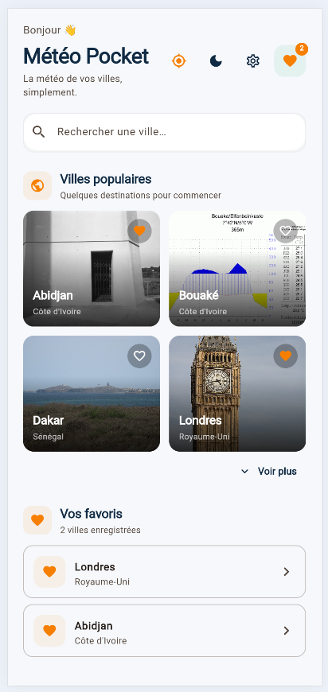
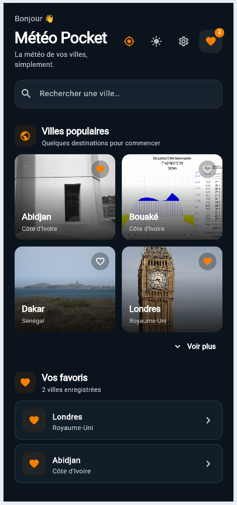
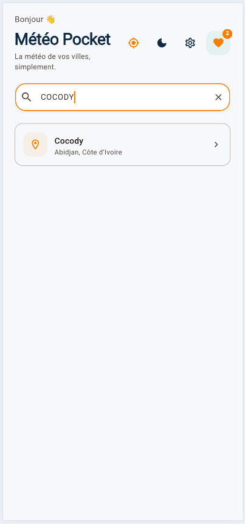
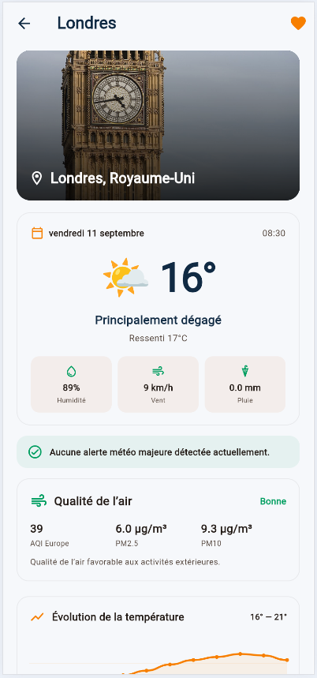
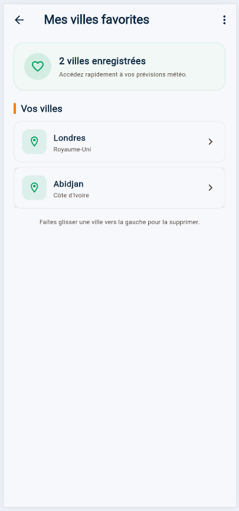

# 🌦️ Météo Pocket V1.0.0

Application météo professionnelle développée avec **Flutter, Dart, Riverpod et Open-Meteo** dans le cadre de l’UE Développement Mobile Avancé.

## Auteurs
- BAMA Stéphane
- KOFFI Niansou Ange Bienvenu

## Fonctionnalités
- Recherche libre de villes avec géocodage Open-Meteo
- Villes populaires
- Météo de la position actuelle (GPS)
- Température, ressenti, humidité, vent, pression, visibilité, précipitations et UV
- Prévisions horaires et 7 jours
- Courbe de température
- Qualité de l’air (PM2.5, PM10, AQI)
- Détection d’alertes météo importantes dans l’application
- Favoris persistants avec suppression par glissement
- Mode clair / sombre / système mémorisé
- Interface Material 3 responsive
- Photos de villes / monuments via Wikimedia Commons
- Gestion Riverpod des états chargement / succès / erreur

## Architecture obligatoire
```text
lib/
├── models/
├── services/
├── providers/
├── views/
└── main.dart
```

## Installation
```bash
flutter pub get
flutter analyze
flutter test
flutter run
```

## Génération APK
```bash
flutter build apk --release
```
## Captures d'écran
### Écran principal de l'application


### Écran principal de l'application en mode Dark


### Écran de recherche d'une ville


### Écran de détail de la météo d'une ville sélectionnée


### Écran des favoris



## Technologies
Flutter · Dart · Riverpod · HTTP · Open-Meteo · Geolocator · SharedPreferences · Material 3

> Projet pédagogique PIGIER — Génie Logiciel / Développement Mobile Avancé Flutter.
